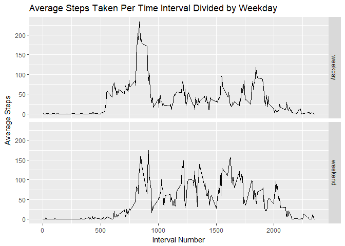

1.  Code for reading in the dataset and/or processing the data

<!-- -->

    require(dplyr)
    t <- read.csv("activity.csv")
    tdate <- group_by(t,date)
    tdatesum <- summarize(tdate, sum(steps, na.rm = TRUE))
    tdatesum$date <- as.Date(tdatesum$date)

1.  Histogram of the total number of steps taken each day

<!-- -->

    require(ggplot2)

    p <- ggplot(tdatesum, aes(x = date, y=`sum(steps, na.rm = TRUE)`)) +geom_bar(stat = "identity") + scale_x_date()
    p2 <- p + ylab("Total Steps") + xlab("Date") + ggtitle("Total Steps Per Day")
    p2

1.  Mean and median number of steps taken each day

<!-- -->

    meansteps <- mean(tdatesum$`sum(steps, na.rm = TRUE)`, na.rm= TRUE)
    meansteps

    ## [1] 9354.23

    mediansteps <- median(tdatesum$`sum(steps, na.rm = TRUE)`)
    mediansteps

    ## [1] 10395

4.Time series plot of the average number of steps taken

    tinterval <- group_by(t, interval)
    tintervalmean <- summarize(tinterval, mean(steps, na.rm = TRUE))
    pint = ggplot(tintervalmean, aes(x=interval, y= `mean(steps, na.rm = TRUE)`)) + geom_line()
    pint2 <- pint + ylab("Average Steps") + xlab("Interval Number") + ggtitle("Average Steps Taken Per Time Interval")
    pint2

5.The 5-minute interval that, on average, contains the maximum number of
steps

    which.max(tintervalmean$`mean(steps, na.rm = TRUE)`)

    ## [1] 104

1.  Code to describe and show a strategy for imputing missing data

Fill in missing values with average value at that interval across all
days.

    table(is.na(t$steps))

    ## 
    ## FALSE  TRUE 
    ## 15264  2304

    timputed <- t
    impute <- function(steps, interval){
        corsteps <- NA
        if(is.na(steps) == TRUE){
            corsteps <- tintervalmean$`mean(steps, na.rm = TRUE)`[which(tintervalmean$interval == interval)]
        }
        else{
            corsteps <- steps
        }
        corsteps
    }
    timputed$steps <- mapply(impute, timputed$steps, timputed$interval)
    table(is.na(timputed$steps))

    ## 
    ## FALSE 
    ## 17568

7.Histogram of the total number of steps taken each day after missing
values are imputed

    tdate <- group_by(timputed,date)
    tdatesum <- summarize(tdate, sum(steps, na.rm = TRUE))
    tdatesum$date <- as.Date(tdatesum$date)

    p <- ggplot(tdatesum, aes(x = date, y=`sum(steps, na.rm = TRUE)`)) +geom_bar(stat = "identity") + scale_x_date()
    p2 <- p + ylab("Total Steps") + xlab("Date") + ggtitle("Total Steps Per Day With Imputation")
    p2

1.  Panel plot comparing the average number of steps taken per 5-minute
    interval across weekdays and weekends

<!-- -->

    library(lubridate)
    t$date <- as.Date(t$date)
    t$day <- wday(t$date)

    is.weekday <- function(day){
        if(day == 1 | day == 7){
            weekday <- "weekend"
        }
        else{
            weekday <- "weekday"
        }
        weekday
    }

    t$weekday <- t$day
    t$weekday <- sapply(t$day, is.weekday)

    tintday <- group_by(t, interval, weekday)
    tintdaymean <- summarize(tintday, mean(steps, na.rm = TRUE))
    pintday = ggplot(tintdaymean, aes(x=interval, y= `mean(steps, na.rm = TRUE)`)) + geom_line()
    pintday2 <- pintday + ylab("Average Steps") + xlab("Interval Number") + ggtitle("Average Steps Taken Per Time Interval Divided by Weekday")
    pintday3 <- pintday2 + facet_grid(weekday ~ .)
    pintday3

